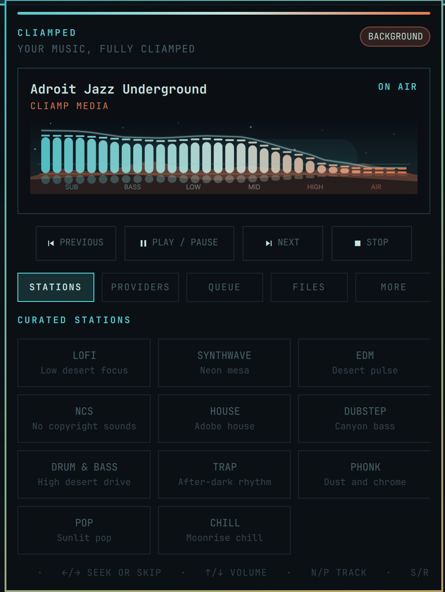
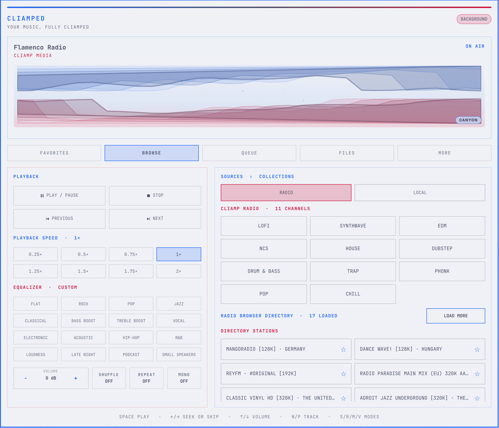
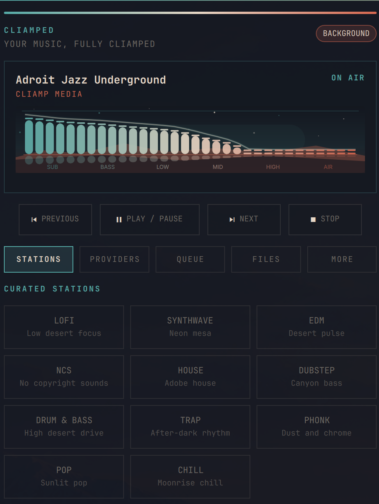

# CLIAMPed

CLIAMPed is a theme-aware Omarchy bar widget and control center for [CLIAMP](https://github.com/bjarneo/cliamp). It brings playback, radio discovery, favorites, collections, local media, and three reactive visualizers into the shell.

Its visualizer and controls take their colors from the current Omarchy theme rather than a bundled palette.

## Features

- Playback, seeking, volume, speed, EQ, shuffle, repeat, and mono controls
- Spectrum, Canyon, and Voxtype-inspired Pulse views driven by `cliamp visstream`
- A synchronized mini visualizer in the bar
- Eleven curated CLIAMP stations over HTTPS
- CLIAMP source and collection browsing, including Radio Browser favorites and its paged catalog
- Real queue inspection, play-next, removal, and clearing
- Multiple-file and recursive whole-folder playback
- Recently played tracks, lyrics, and audio-output switching
- Keyboard control while the panel is focused
- Automatic attachment to an existing CLIAMP TUI or daemon
- A self-started background daemon when CLIAMP is not already running

CLIAMPed uses CLIAMP's version 2 Unix-socket API with authenticated peers, correlated request and job IDs, bounded frames, and absolute deadlines. It serializes requests so concurrent panel actions cannot corrupt responses. File and folder selection runs behind a bounded Zenity supervisor, keeping native picker failures outside Quickshell. The complete runtime trust model and limits are documented in [`SECURITY.md`](SECURITY.md).

## Theme gallery

CLIAMPed reads its panel, text, accent, urgent, and bar colors from Omarchy, so the same controls adapt to both dark and light themes.

| Hacker Bunker | Catppuccin Latte | Santa Fe |
|:---:|:---:|:---:|
| Favorites · Spectrum | Browse · Canyon | Queue · Pulse |
|  |  |  |

## Favorites, sources, and collections

These views have distinct jobs:

- **Favorites** collects Radio Browser stations starred from Browse.
- **Browse** reflects CLIAMP's configured source hierarchy. Radio exposes the eleven CLIAMP Radio channels plus its paged Radio Browser directory; Local exposes saved TOML collections and Recently Played when available.
- **Queue** is CLIAMP's active playback list.

Selecting a collection replaces the active list and starts its first track. Selecting a station or source search result also starts it immediately.
CLIAMPed resolves CLIAMP Radio's built-in M3U index through CLIAMP's `url.load` IPC endpoint before playback.
The Radio Browser directory loads automatically; use ☆ and ★ on directory or search-result cards to add or remove Favorites. Because CLIAMP's search IPC omits the playlist IDs required by its native favorite endpoint, searched-station favorites are stored separately in `~/.config/cliamp/cliamped_search_favorites.json` and merged into the same Favorites view.

## Local files and folders

The Files tab offers **Choose Files…** and **Add Folder…**. CLIAMPed closes its layer panel before opening the native picker so the picker stays visible, then returns to Files on cancel/error or Queue after a successful selection. Folder imports:

- recurse through subfolders;
- sort paths in natural filename order (`2` before `10`);
- ignore hidden files, AppleDouble `._` metadata, and unsupported formats;
- stay on one filesystem, never follow symlinks, and enforce traversal/depth/time limits;
- admit at most 20 audio files per selection;
- play the first track and put every remaining track in CLIAMP's Queue.

Supported extensions are MP3, FLAC, Ogg Vorbis, Opus, WAV, M4A, AAC, and WMA.

## Installation

Requirements:

- Omarchy with shell plugin support
- CLIAMP 2.0 or newer installed at `/usr/bin/cliamp`
- Python 3 installed at `/usr/bin/python3`
- Zenity installed at `/usr/bin/zenity`

Install and enable the plugin:

```bash
omarchy plugin add https://github.com/majesticio/omarchy-cliamped-plugin.git --enable
```

If CLIAMP is already running, CLIAMPed attaches to it and never stops it. Otherwise, it starts a supervised `/usr/bin/cliamp --daemon --provider radio` session owned by the plugin. Plugin-owned sessions are stopped during plugin or shell teardown so their audio/provider process tree cannot be orphaned.

Remove it with:

```bash
omarchy plugin remove io.github.majesticio.cliamped
```

## Controls

Bar:

- Left click: open or close CLIAMPed
- Middle click: play or pause
- Right click: next queued track or station

Focused panel:

- Space: play or pause
- Left / Right: seek ten seconds, or previous / next on a live stream
- Up / Down: volume by 2 dB
- N / P: next / previous
- S / R / M: shuffle / repeat / mono
- V: cycle Spectrum, Canyon, and the Voxtype-inspired Pulse history; clicking the visualizer cycles them too
- Escape: close the panel

Shell IPC:

```bash
/usr/bin/omarchy-shell io.github.majesticio.cliamped open
/usr/bin/omarchy-shell io.github.majesticio.cliamped tab browse
/usr/bin/omarchy-shell io.github.majesticio.cliamped visualizer Pulse
/usr/bin/omarchy-shell io.github.majesticio.cliamped close
```

The `tab` endpoint accepts `favorites`, `browse`, `queue`, `files`, or `more`. The `visualizer` endpoint accepts `Spectrum`, `Canyon`, or `Pulse`.

## Optional Codex skill

This repository includes an automatically discoverable [`cliamp-control`](skills/cliamp-control/SKILL.md) skill for controlling CLIAMP playback and the CLIAMPed interface through Codex. After installing the plugin, link the bundled skill into your personal skill directory:

```bash
mkdir -p ~/.codex/skills
ln -s ~/.config/omarchy/plugins/io.github.majesticio.cliamped/skills/cliamp-control ~/.codex/skills/cliamp-control
```

Start a new Codex session after linking it. The skill uses CLIAMP's public commands for ordinary controls, its structured socket API for provider operations, and CLIAMPed's shell IPC for tabs and visualizers; no MCP server is required.

## Development

Validate the package and run its helper tests:

```bash
omarchy plugin validate .
/usr/bin/python3 -m unittest discover -s tests -v
```

The isolated Python compatibility entry point `cliamp-ipc.py` is retained for panels cached from earlier development builds.

## Relationship to CLIAMP

CLIAMPed is an independent community companion for CLIAMP and is not an official CLIAMP project. CLIAMP remains the playback engine and source of truth for its queue, providers, and media state.

## License

MIT. See `NOTICE` for attribution to CLIAMP's MIT-licensed Quickshell band-stream pattern.
